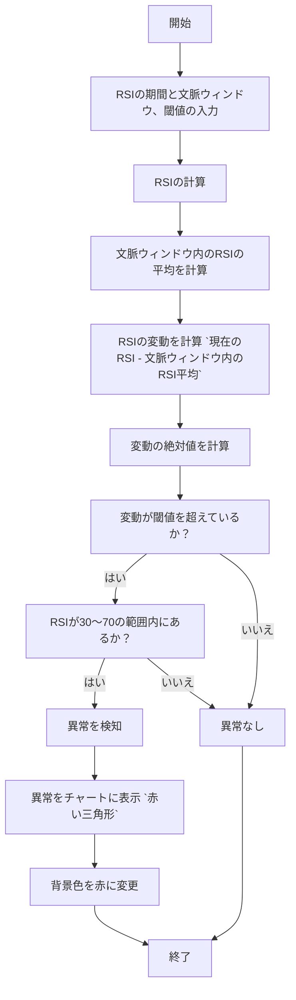

# rsi_contextual_anomaly_detection
### このシグナルのスコープ
・RSI中間付近で大きな動きがあった時
・RSI70、30にいい感じに突き刺さる時

### より精度を高めるためのフィルタリング

### シグナルのロジック

```mermaid
flowchart TD
    A[開始] --> B[RSIの期間と文脈ウィンドウ、閾値の入力]
    B --> C[RSIの計算]
    C --> D[文脈ウィンドウ内のRSIの平均を計算]
    D --> E[RSIの変動を計算 `現在のRSI - 文脈ウィンドウ内のRSI平均`]
    E --> F[変動の絶対値を計算]
    F --> G[変動が閾値を超えているか？]
    
    G --> |はい| H[RSIが30〜70の範囲内にあるか？]
    G --> |いいえ| I[異常なし]
    
    H --> |はい| J[異常を検知]
    H --> |いいえ| I[異常なし]
    
    J --> K[異常をチャートに表示 `赤い三角形`]
    K --> L[背景色を赤に変更]
    L --> M[終了]

    I --> M[終了]
```
